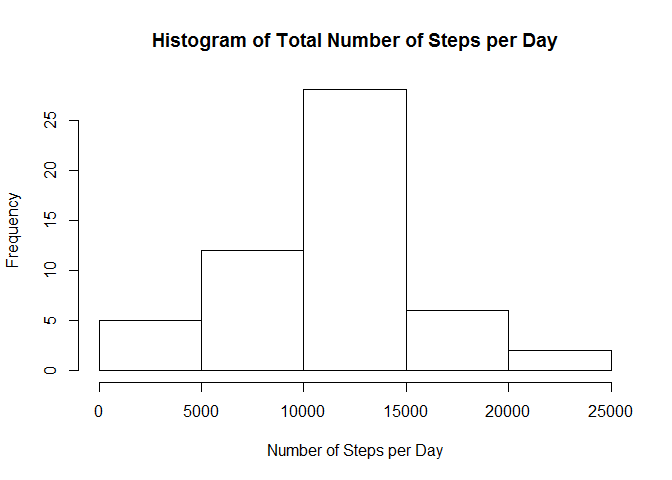
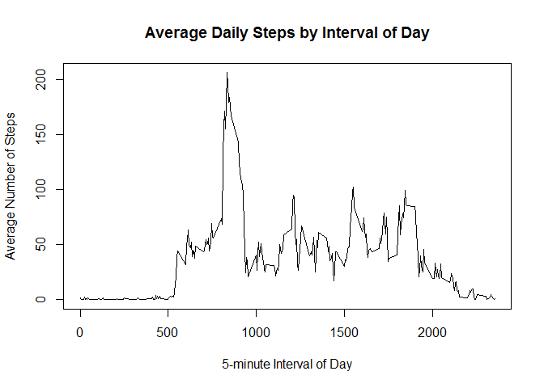
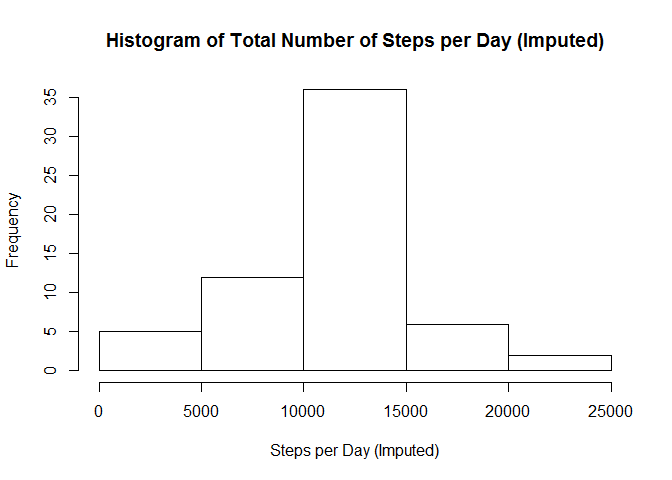
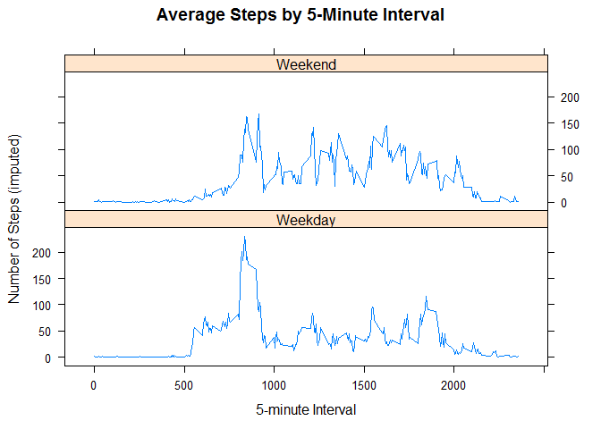

# Reproducible Research: Peer Assessment 1
Author: "Matthew Renze"  
Date: "02/14/2015"

## Loading and preprocessing the data


```r
# Load the data
data <- read.csv("activity.csv")
```

## What is mean total number of steps taken per day?

```r
# Load dplyr library
library(dplyr)

# Get sum of steps by day
totals <- data %>%
  do(filter(., complete.cases(.))) %>%
  group_by(date) %>% 
  summarise(steps = sum(steps))

# Create a histogram of the total number of steps per day
hist(
  x = totals$steps,
  main = "Histogram of Total Number of Steps per Day",
  xlab = "Number of Steps per Day")
```

 

```r
# Calculate the mean and median steps per day
meanSteps <- mean(totals$steps)
medianSteps <- median(totals$steps)
```
The mean number of steps is 10,766.19.  
The median number of steps is 10,765.


## What is the average daily activity pattern?

```r
# Get average steps by interval
averages <- data %>% 
  do(filter(., complete.cases(.))) %>%
  group_by(interval) %>% 
  summarise(steps = mean(steps))

# Plot timeseries of average steps by interval of day
plot(
  x = averages$interval,
  y = averages$steps,
  type = "line",
  main = "Average Daily Steps by Interval of Day",
  xlab = "5-minute Interval of Day",
  ylab = "Average Number of Steps")
```

 

```r
# Get the interval with the max average steps
max <- averages %>% 
  filter(steps == max(steps))
```
The 5-minute interval with the maximum number of steps across all days is interval 835 with 206.17 steps.

## Imputing missing values
For our strategy to impute missing values, we will use the average value for the corresponding 5-minute interval across all days.

```r
# Count NA values
nas <- sum(is.na(data$steps))
```
There are 2304 rows containing missing (NA) values.


```r
# Copy raw data
imputed <- data.frame(data)

# Impute missing values using average daily steps
for(i in 1:nrow(imputed)){
    if(is.na(imputed[i, "steps"])){
      imputed[i, "steps"] <- data %>% 
        do(filter(., complete.cases(.))) %>%
        filter(interval == imputed[i, "interval"]) %>%
        group_by(interval) %>% 
        summarise(steps = mean(steps)) %>%
        select(steps)
  }
}

# Get sum of steps by day (imputed)
imputedTotals <- imputed %>%
  do(filter(., complete.cases(.))) %>%
  group_by(date) %>% 
  summarise(steps = sum(steps))

# Create a histogram of the total number of steps per day (imputed)
hist(
  x = imputedTotals$steps,
  main = "Histogram of Total Number of Steps per Day (Imputed)",
  xlab = "Steps per Day (Imputed)")
```

 

```r
# Calculate the mean and median steps per day (imputed)
imputedMeanSteps <- mean(imputedTotals$steps)
imputedMedianSteps <- median(imputedTotals$steps)
```
The mean number of steps (imputed) is 10,766.19.  
The median number of steps (imputed) is 10,766.19.  

So, when using imputed values, the mean stayed the same and the median was moved to a day with all imputed values.  

## Are there differences in activity patterns between weekdays and weekends?


```r
# Define weekends
weekends = c("Saturday", "Sunday")

# Add a factor variable for type of day
for(i in 1:nrow(imputed)){
  if (weekdays(as.Date(imputed[i, "date"])) %in% weekends) {
    imputed[i, "type"] = "Weekend"
  }
  else {
    imputed[i, "type"] = "Weekday"
  }
}

# Convert day type to factor
imputed$type <- as.factor(imputed$type)

# Get average steps by interval
imputedAverages <- imputed %>% 
  group_by(interval, type) %>% 
  summarise(steps = mean(steps)) %>%
  arrange(type, interval)

# Load lattice library
library(lattice)

# Create plot
xyplot(
  steps~interval|type,
  data = imputedAverages,
  type = "l",
  main = "Average Steps by 5-Minute Interval",
  xlab = "5-minute Interval",
  ylab = "Number of Steps (imputed)",
  layout=c(1,2))
```

 
